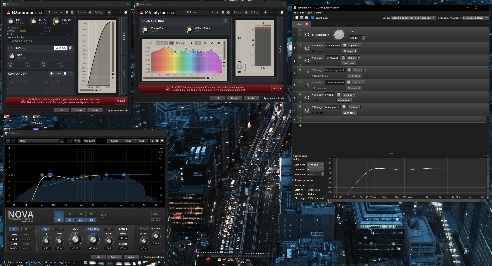

# VST Loopback Capture & Visualization Feature Context

This repo folk from @TheFireKahuna/equalizerAPO64

This document describes the implementation of the VST Loopback Capture feature for Equalizer APO's Editor. It serves as a context reference for future development, bug fixing, and feature upgrades.

## 0. Prerequisites for Development

Before attempting to build or modify this feature, ensure the following are installed and configured:

### A. Development Tools

- **Visual Studio 2022:** Community Edition or higher.
  - **Workload:** "Desktop development with C++"
  - **Component:** MSVC v143 - VS 2022 C++ x64/x86 build tools (or v145 if using latest preview).
  - **Windows SDK:** Windows 10 or 11 SDK.

### B. Frameworks & Libraries

- **Qt 6:** Specifically **Qt 6.7.3** (MSVC 2022 64-bit).
  - Install via the Qt Online Installer.
  - Ensure the `Qt6` directories (`bin`, `include`, `lib`) are accessible or configured in your environment.
  - **Required Modules:** `Qt Creator`, `Qt 6.7.3` -> `MSVC 2022 64-bit`, `Sources`.

### C. External Libraries (Provided in Repository)

The repository includes necessary pre-compiled static libraries in the `external-lib` directory. **DO NOT DELETE** this folder.

- **FFTW 3:** Double precision version (`libfftw3-3.lib`).
- **LibSndFile:** Audio file IO library.
- **MuParserX:** Math parser library.

## 0.5. Development Flow & Architecture (Mental Model)

To understand how this project is built and run, visualize the following components:

### 1. The Builder (Visual Studio 2022)

- **Role:** The factory that takes source code and builds the executable.
- **Input:** Source files (`.cpp`, `.h`) + Project File (`Editor.vcxproj`).
- **Action:** It compiles the code and **links** it against the **Static Libraries** found in `external-lib` (e.g., `libfftw3-3.lib`, `sndfile.lib`).
- **Output:** `Editor.exe`.

### 2. The Framework (Qt 6)

- **Role:** The engine for the User Interface (Windows, Buttons, Graphs).
- **Development:** You need the Qt VS Tools or Qt Creator to manage UI files (`.ui`).
- **Runtime:** `Editor.exe` cannot run alone; it needs the **Qt Runtime DLLs** (`Qt6Core.dll`, `Qt6Gui.dll`, etc.) to be present in the same folder or system path.

### 3. The External Dependencies (Runtime DLLs)

- **Role:** Specialized workers that `Editor.exe` hires at runtime.
- **FFTW (`libfftw3-3.dll`):** Performs complex math (Fast Fourier Transform) for audio analysis.
- **LibSndFile (`sndfile.dll`):** Reads and writes audio files.
- **Critical Note:** VS links against the _.lib_ files during build, but the app needs the _.dll_ files during run. We keep these in `Setup\lib64`.

### 4. The Packager (NSIS Installer)

- **Role:** The delivery truck.
- **Input:** `Setup.nsi` script.
- **Action:** It gathers `Editor.exe`, the Qt DLLs, and the External DLLs (from `Setup\lib64`) into a single `EqualizerAPO_Setup.exe`.
- **Result:** The end user gets a complete package that "just works".

**Mental Model Summary:**
`Source Code` + `External Libs (.lib)` -> **Compiler (VS)** -> `Editor.exe`
`Editor.exe` + `Qt DLLs` + `FFTW/SndFile DLLs` -> **The Running App**

## 1. Feature Overview

The **VST Loopback Capture** feature allows VST plugins loaded within the Equalizer APO Editor to visualize audio in real-time. Since the Editor does not process live audio itself (it only generates config files), this feature uses **WASAPI Loopback** to capture the system's audio output and feed it into the VST plugin's processing loop solely for visualization purposes.

## 2. Core Implementation Components

### A. Audio Capture (`WASAPILoopback`)

- **File:** `Editor/helpers/WASAPILoopback.cpp`, `Editor/helpers/WASAPILoopback.h`
- **Purpose:** Captures system audio output using the Windows Audio Session API (WASAPI) in loopback mode.
- **Mechanism:**
  - Initializes a capture client on the default audio render device.
  - buffers captured audio.
  - Provides a `readSamples` method to retrieve standardized audio data (float, interleaved or deinterleaved).

### B. VST GUI Integration (`VSTPluginFilterGUI`)

- **File:** `Editor/guis/VSTPluginFilterGUI.cpp`
- **Modifications:**
  - **Loopback Integration:** Instantiates `WASAPILoopback` when the VST GUI window is opened.
  - **Buffering:** Implements a fixed-size buffer (512 samples) to ensure stable VST processing. This mimics a real audio host's callback structure.
  - **Thread Safety:** Uses `QMutex` to lock critical sections, preventing race conditions between the UI thread and the audio processing loop (especially during VST initialization/destruction).
  - **Channel Management:**
    - **Cap:** Inputs and Outputs are explicitly capped at **32 channels** to prevent crashes with plugins that report excessive channel counts (e.g., MAnalyzer reporting 64+ channels).
    - **Mapping:** Deinterleaves and maps loopback audio to the VST's expected input channels.

### C. VST Instance Handling (`VSTPluginInstance`)

- **File:** `Editor/helpers/VSTPluginInstance.cpp`
- **Critical Fixes:**
  - **Time Info Flags:** Manually defined and implemented `vst_time_info` flags (e.g., `kVstTransportPlaying`, `kVstTempoValid`). This fixes crashes in plugins like **MAnalyzer** that rely on host time information.
  - **Callback Handling:** Updated the `hostCallback` to return valid time info when requested by the plugin opcode `VST_HOST_OPCODE_GET_TIME`.

## 3. Build System & Dependencies

### Project Configuration (`Editor.vcxproj`)

- **Platform:** x64 (Targeting 64-bit Windows).
- **Toolset:** v145 (Visual Studio 2022).
- **Dependencies:**
  - **FFTW:** Links against `libfftw3-3.lib` (Double Precision).
  - **LibSndFile:** Links against `sndfile.lib`.
  - **Qt6:** Requires Qt 6.7.3 (Core, Gui, Widgets).

### Runtime Requirements

The compiled `Editor.exe` requires the following DLLs to be present in the same directory (or system path):

1.  **`libfftw3-3.dll`** (Note: NOT `libfftw3.dll` or `libfftw3f.dll`. The code uses double precision).
2.  **`sndfile.dll`**
3.  **Qt6 DLLs** (`Qt6Core.dll`, `Qt6Gui.dll`, `Qt6Widgets.dll`, etc.).

**Location:** These external DLLs have been organized into the **`Setup\lib64`** directory for inclusion in the installer.

## 4. Debugging & Logging

### Log Mechanism

- **File:** `helpers/LogHelper.h`
- **Output:** `%TEMP%\EqualizerAPO.log`
- **Usage:**
  - Use `LogF(L"Message %d", value)` for general logging.
  - Use `LogFStatic` for logging from static contexts (like `main`).

### Key Log Entries to Watch

- `Editor: Application started` - Confirms the app entry point.
- `VSTPluginFilterGUI: Constructor called` - Confirms VST GUI instantiation.
- `VSTPluginFilterGUI: Processing loopback audio...` - Confirms the loopback thread is active and feeding data.

## 5. Future Development Notes

- **Updating VST SDK:** If updating `aeffectx.h`, ensure the manual time info flag definitions in `VSTPluginInstance.cpp` are handled correctly (either removed if the SDK includes them, or kept if using an older header).
- **MAnalyzer/TDR Nova:** These plugins were specific stress tests for this feature. Always verify against them when making changes to `VSTPluginInstance` or buffering logic.
- **Installer:** When updating the installer (`Setup.nsi`), remember to reference `libfftw3-3.dll` and not the older filenames.
